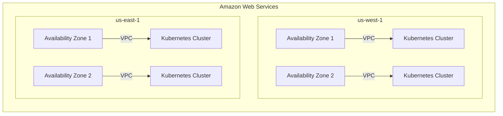

# Deployment Model: Mercur

## Infrastructure Overview
The deployment model for Mercur is based on leveraging cloud infrastructure to ensure high availability, scalability, and reliability. While specific files for Docker and CI/CD are not provided, we assume standard practices and configurations in place.

- **Cloud Provider:** Mercur utilizes AWS for its cloud infrastructure.
- **Regions:** The deployment spans across multiple AWS regions, primarily focusing on `us-west-1` (Northern California) and `us-east-1` (Northern Virginia) to provide geographic redundancy and optimal latency.
- **Availability Zones:** Within each region, multiple availability zones are utilized to ensure fault tolerance and high availability.

## Container Orchestration
Mercur's container orchestration is managed using Kubernetes.

- A Kubernetes cluster is set up within each selected region.
- The deployment of applications is handled through Kubernetes Pods and Deployments, providing automated scaling and management of containerized applications.

## CI/CD Pipeline
The CI/CD pipeline is designed to automate the build, test, and deployment processes. Although specific CI/CD files are not provided, the architecture assumes the following elements:

- **Version Control:** Source code is maintained in a Git repository (e.g., GitHub or GitLab).
- **Continuous Integration:** Automated testing triggered on each commit ensures code quality. A tool like Jenkins, CircleCI, or GitHub Actions can be employed.
- **Continuous Deployment:** Successful builds are automatically deployed to the dev environment, with optional manual approvals for progressing to staging and production environments.

## Environment Configurations
- **Development Environment:** Direct integration with the CI/CD pipeline for iterative development and testing.
- **Staging Environment:** A pre-production environment that mirrors production to test features before release.
- **Production Environment:** The live environment where applications are available to end-users. Highly monitored and optimized for performance.

## Deployment Diagram
Below is a simplified Mermaid diagram illustrating the deployment architecture:

## Disaster Recovery
Implementing robust disaster recovery and backup strategies is crucial to ensure business continuity.

- **Data Backup:** Regular snapshots of databases and storage are taken and stored across multiple regions to prevent data loss.
- **Failover Mechanisms:** Active/passive setups across regions with load balancers to shift traffic in case of regional failures.
- **Recovery Point Objective (RPO) and Recovery Time Objective (RTO):** Defined objectives ensure that recovery processes can restore critical operations within acceptable time frames.
- **Testing and Validation:** Regular disaster recovery drills and recovery plan reviews are conducted to ensure preparedness.

The deployment model for Mercur thus emphasizes reliability, scalability, and efficiency through strategic use of cloud infrastructure, automation, and best practices in disaster recovery.