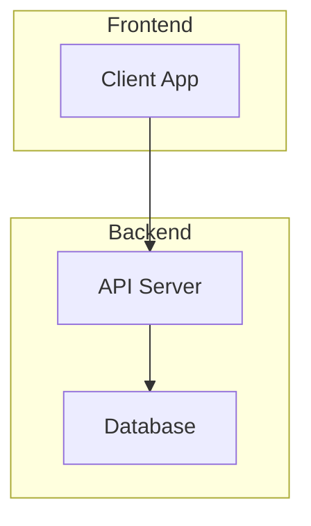

# High-level Architecture: Mercur

## Overview
Mercur is an open-source marketplace platform designed to offer both the simplicity of a SaaS solution and the flexibility of open-source software. Its purpose is to enable businesses to create customized and scalable marketplaces across various business models. Built on top of MedusaJS, Mercur ensures full control over infrastructure, customizations, and data management.

## System Components

### Frontend
- **Client App**: The user interface that marketplace users interact with. This component handles user interactions and display logic. It communicates with the backend to fetch and display data, and to send user inputs and actions.

### Backend
- **API Server**: The core of the Mercur platform responsible for processing business logic, handling API requests, and interfacing with the database. It serves as the bridge between the frontend client and the database, ensuring secure data processing and transaction handling.
- **Database**: The data storage layer that maintains all persistent data related to users, products, transactions, and marketplace configurations. The database is crucial for ensuring data integrity and providing quick access to stored information.

## External Services & Integrations
- **MedusaJS**: A backend framework that Mercur is built upon, providing foundational functionalities like product management and order processing. It simplifies complex marketplace operations with a robust set of APIs and tools.

## Communication Patterns
- **REST API**: The primary method of communication between the frontend client app and the backend API server. REST APIs facilitate standard HTTP requests for CRUD (Create, Read, Update, Delete) operations, ensuring seamless data exchange across the platform.

## Data Storage Strategy
- **Database Management**: Mercur utilizes a relational database to organize and manage marketplace data, ensuring data consistency and reliability.
- **Caching Strategy**: While the specific caching mechanism is not detailed, it is common for platforms like Mercur to employ caching strategies to reduce database load and improve response times (e.g., in-memory caching solutions).

## Architecture Diagram

## Technology Stack
- **Languages**: The platform is largely built using JavaScript and TypeScript.
- **Frameworks**: MedusaJS is a prominent component, providing a suite of tools and functionalities for marketplace operations.
- **Package Manager**: Yarn (`yarn@1.22.21`) is used for managing dependencies and running scripts.

## Deployment Model
- **Containerization**: Docker is used to deploy the API server, ensuring consistent environment configuration across different deployment stages (development, testing, production).
- **Infrastructure**: Although specific cloud providers or regions are not mentioned, the usage of Docker hints at potential deployment flexibility across various cloud services.

## Security Considerations
- **Authentication**: JWT (JSON Web Tokens) is employed for securing API endpoints and authenticating user requests.
- **CORS Management**: Configurable CORS (Cross-Origin Resource Sharing) settings provide controlled access to resources, ensuring only authorized domains can interact with the backend.

By combining a user-friendly frontend and a robust backend, Mercur presents a scalable and flexible architecture designed to meet dynamic marketplace needs.